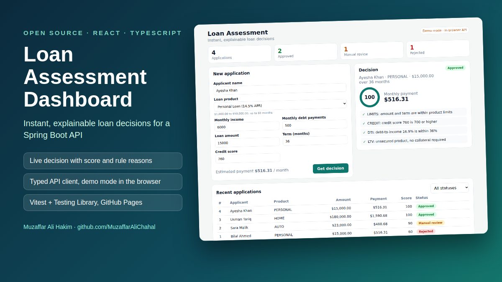
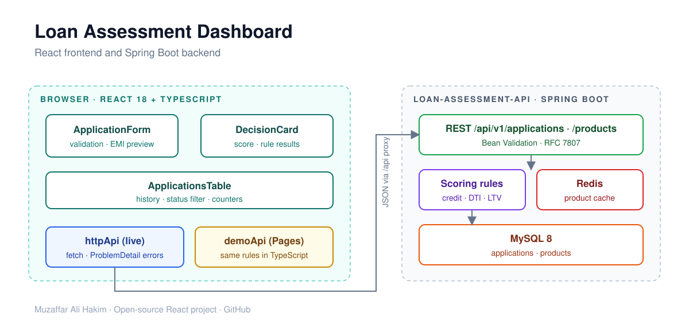

# Loan Assessment Dashboard (React + TypeScript)


   

A React web dashboard for my [Loan Assessment API](https://github.com/MuzaffarAliChahal/loan-assessment-api) (Java 21, Spring Boot).
Loan officers enter an application, get an instant **Approved / Manual review / Rejected** decision with a score, and see the reason behind every rule.

**Live demo:** [muzaffaralichahal.github.io/loan-assessment-dashboard](https://muzaffaralichahal.github.io/loan-assessment-dashboard/) (runs fully in the browser, no backend needed)



## Features

- **Application form** with client-side validation, product limits, and a live **monthly payment (EMI) preview**
- Collateral field appears only for **secured products** (home, auto)
- **Decision card** with score ring, monthly payment and colour-coded rule results
- **Recent applications** table with status filter and summary counters
- Reads RFC 7807 `ProblemDetail` errors from the API and shows **server-side field errors** in the form
- **Two modes**
  - *Live*: calls the Spring Boot API through the Vite dev proxy (no CORS setup needed)
  - *Demo*: an in-browser copy of the scoring rules, used for the GitHub Pages demo
- **Tests** with Vitest and React Testing Library (scoring rules mirror the Java tests, full user flows)
- **CI** on GitHub Actions, automatic deploy of the demo to GitHub Pages



## Run it

```bash
npm install
npm run dev            # http://localhost:5173, proxies /api to http://localhost:8080
```

Start the backend first (`docker compose up` in [loan-assessment-api](https://github.com/MuzaffarAliChahal/loan-assessment-api)), or run without it:

```bash
VITE_DEMO=true npm run dev
```

Other scripts:

```bash
npm test               # Vitest + React Testing Library
npm run build          # type-check and production build
```

## Project structure

```
src/
├── App.tsx                     # page layout, data loading, error handling
├── components/
│   ├── ApplicationForm.tsx     # controlled form, validation, EMI preview
│   ├── DecisionCard.tsx        # score ring and rule results
│   ├── ApplicationsTable.tsx   # history with status filter
│   └── StatusBadge.tsx
└── lib/
    ├── api.ts                  # typed HTTP client + in-browser demo API
    ├── scoring.ts              # TypeScript copy of the scoring rules
    └── types.ts                # API types
```

The screenshot at the top is generated from the demo build by [`scripts/readme-screenshots.mjs`](scripts/readme-screenshots.mjs) (Playwright). Run the **Update README screenshots** workflow in the Actions tab to refresh it.

## License

MIT
